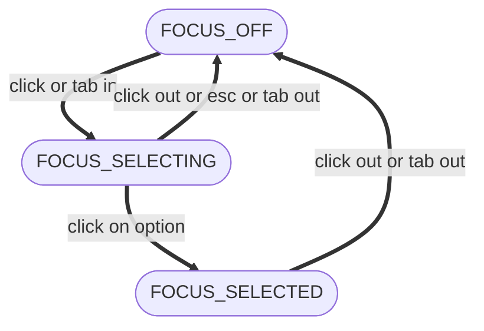

# Autocomplete

```mermaid
flowchart TD
    FOCUS_OFF([FOCUS_OFF])
    FOCUS_SELECTING([FOCUS_SELECTING])
    FOCUS_SELECTED([FOCUS_SELECTED])

    FOCUS_OFF =="click or tab in"==>FOCUS_SELECTING

    FOCUS_SELECTING =="click on option"==> FOCUS_SELECTED

    FOCUS_SELECTING =="click out or esc or tab out"==>FOCUS_OFF

    FOCUS_SELECTED =="click out or tab out"==> FOCUS_OFF


```
