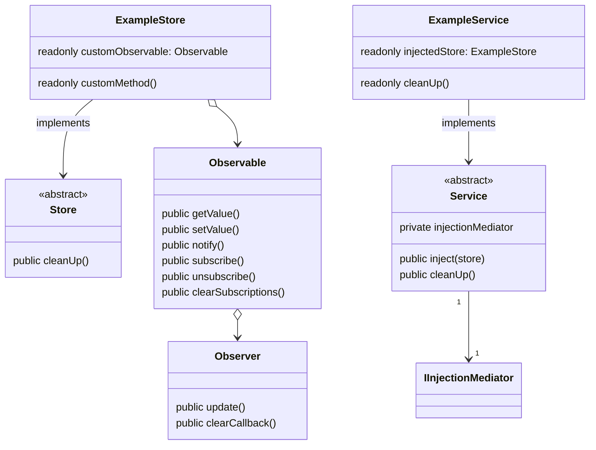
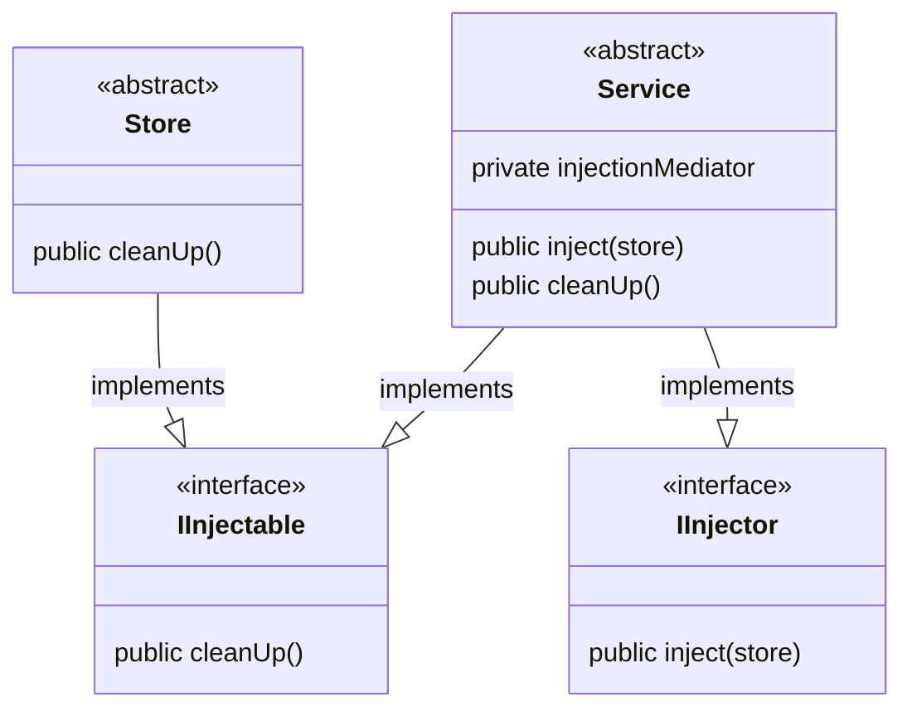
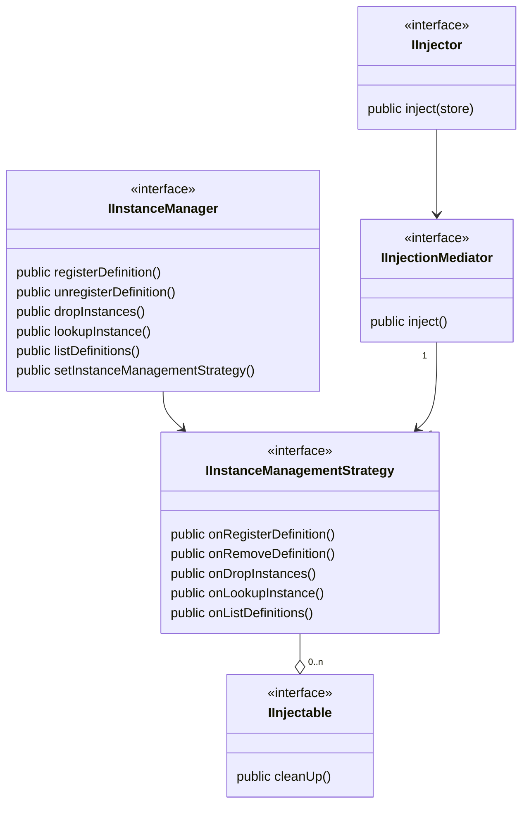

# @premail/state

## UML diagram Usage by user

```typescript
class ExampleService implements Service {
  readonly injectedStore = this.inject(storeDefinition2);
  readonly getValue = () => {
    return this.injectedStore.instance.customObservable.getValue();
  };
  readonly cleanUp = () => {
    this.injectedStore = null;
  };
}

const serviceDefinition = createDefinition({ class: UserStore });

class ExampleStore implements Store {
  readonly customObservable = new Observable(100);
  readonly cleanUp = () => {
    this.customObservable.clearSubscriptions();
  };
}

const storeDefinition = createDefinition({ class: UserStore2 });
```



## UML diagram core classes

### Stores and services



### Instance manager and helper interfaces


